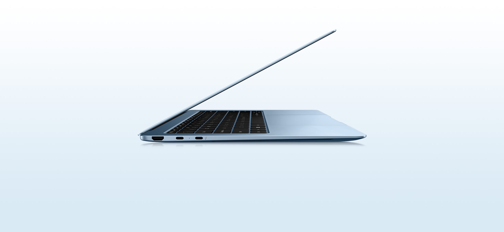
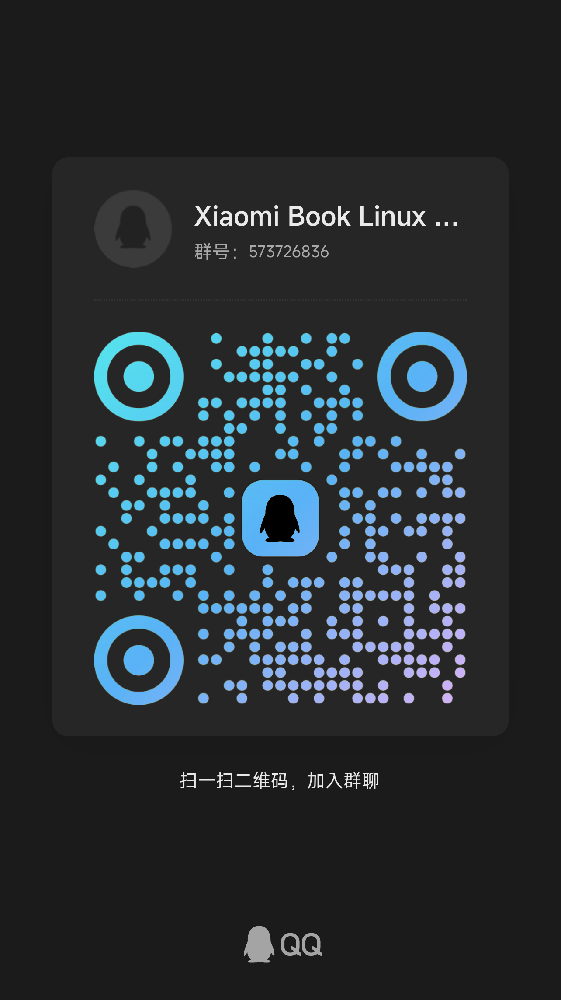

# Xiaomi Book Pro 14 2026 Linux 使用指南

在这里主要汇总一下在 [Xiaomi Book Pro 14（2026 款）](https://www.mi.com/prod/xiaomi-book-pro-14) 上使用 Linux 时遇到的各种问题，并且给出缓解方案 (注意这里不是解决方案，因为解决应该是小米笔记本官方来解决)。期待小米笔记本团队在未来能够通过固件升级解决以下的问题。

## 设备概述

测试使用的型号是蓝色中配，具体配置如下:

- **型号**: Xiaomi Book Pro 14 2026
- **处理器**: Intel Core Ultra 5 338H
- **显卡**: Intel Panther Lake Arc B370
- **屏幕**: 14 英寸 3120×2080，EDO 面板

更详细的设备识别信息请参考 [Hardware Probe](https://linux-hardware.org/?probe=5cef649b03)，也希望同机型其他配置的用户贡献 Hardware Probe 信息，丰富社区数据库。

## 总体情况

在 Fedora Rawhide 下，使用 Linux 7.0+ 内核，笔记本大部分功能可以做到开箱即用，有一小部分工作不正常，具体情况如下:

| 功能 | Linux 7.0 | Issue 追踪 | 缓解方案 | 备注 |
|:--:|:--:|:--:|:--:|:--:|
|屏幕|⚠️|xe 驱动 [Issue](https://gitlab.freedesktop.org/drm/xe/kernel/-/work_items/7677)|启动参数添加 `xe.psr2_sel_fetch=0`|屏幕固件问题 默认情况花屏拖影|
|指纹|❌| libfprint [PR](https://gitlab.freedesktop.org/libfprint/libfprint/-/merge_requests/577)| 自行编译安装 libfprint | 实际上驱动已支持，只是没有添加设备 PID   添加 PID 的 PR 上游已合并，等待 Release (1.94.11) |
|键盘|❌|Linux 暂未上报|见 [键盘失灵缓解方案](keyboard-fix.md)|疑似 EC 问题|
|WiFi|✅|-|-||
|蓝牙|✅|-|-||
|摄像头|✅|-|-||
|NFC|✅|-|-| 可以识别 NFC 设备并修改内容， 无 Windows 下互联作用 (需软件适配) |
|触控板|✅|-|-||

## 反馈情况

通过小米客服和邮件进行了 2 次反馈，并没有得到问题跟进情况或其他类型的反馈。

如果你是小米笔记本团队官方人员，请通过我的 Github 主页提供的联系信息联系我。

## 贡献

欢迎提交 Issue 或 Pull Request 来完善本文档

## 加入讨论

欢迎加入下面的 QQ 群讨论在小米笔记本 Pro 14 上 Linux 的心得体会，并督促小米笔记本团队改善 Linux 使用体验

